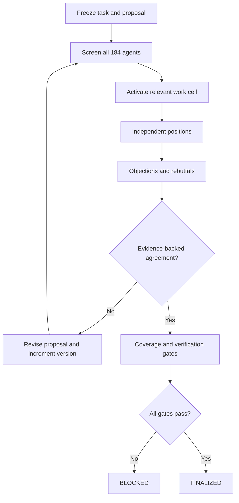

# Executable Engineering Conference Runtime

## Status and boundary

This repository contains an executable alpha of the multi-agent product-design conference. It compiles the 184 canonical specialists into machine-readable configurations, screens every specialist against every proposal version, runs independent analysis for the active work cell, turns disagreement or missing evidence into explicit objections, iterates versioned revisions, and refuses finalization when coverage or evidence checks fail.

The conference remains an **orchestration and decision-control layer**. It does not make an arbitrary model truthful and does not replace physical testing. The repository now also supplies content-addressed evidence, narrow project ingestion, typed instrument-control primitives, diagnostic simulation, an authenticated job service and a reference model gateway. The included dry-run provider deliberately produces `insufficient_evidence`; therefore a dry run can prove routing, persistence and fail-closed behavior but can never approve a product.

No software can guarantee “no hallucinations” or “no errors.” This runtime reduces those risks through independent analysis, registered evidence identifiers, explicit assumptions, typed outputs, objection ownership, revision invalidation, independent critics and deterministic release gates. Consequential claims still require source validation, calculation, simulation, experiment or authorized human review.

## Implemented control loop



“Every agent attends” means every configured specialist receives a relevance disposition for the current proposal version. Deep analysis is limited to `primary`, `reviewer`, and `affected` agents. `monitor` and `out_of_scope` records remain auditable. This preserves coverage while preventing irrelevant voices from flooding the technical discussion.

## Runtime components

| Component | Implementation | Responsibility |
|---|---|---|
| Agent compiler | `scripts/compile_agent_configs.py` | Enforces a one-to-one mapping between the registry, detailed handbook definitions and 184 YAML agent records. |
| Directory | `src/ai_hardware_copilot/directory.py` | Loads agent configs, rejects duplicate IDs and validates file identity. |
| Router | `src/ai_hardware_copilot/routing.py` | Combines deterministic rules, task terms, mandatory agents, semantic provider assessment and dependency expansion. |
| State machine | `src/ai_hardware_copilot/conference.py` | Controls context freeze, screening, independent analysis, objections, deliberation, revision, re-screening, coverage and finalization. |
| Provider boundary | `src/ai_hardware_copilot/provider.py` | Supports dry-run, scripted evaluation and a provider-neutral JSON-over-HTTP model gateway. |
| Persistence | `src/ai_hardware_copilot/storage.py` | Atomically writes the complete state and replayable event stream. |
| Report | `src/ai_hardware_copilot/report.py` | Renders attendance, positions, objections and release checks from structured state. |
| Policy/config | `config/` | Stores mandatory review rules, capability dependencies, model profiles, tool permission levels and compiled agents. |
| Contracts | `schemas/conference/` | Defines task, attendance, position, objection, deliberation, synthesis, revision, coverage and decision objects. |
| Evidence store | `src/ai_hardware_copilot/evidence.py` | Stores immutable blobs and configuration-addressed records, verifies integrity/lineage and records explicit claim assessments. |
| Model router/gateway | `model_router.py`, `gateway.py` | Selects reasoning profile and validates authenticated backend JSON against the operation schema with prompt/model provenance. |
| Project ingestion | `project.py` | Registers and indexes a bounded KiCad/BOM/firmware/Git subset with source evidence links. |
| Diagnostic loop | `diagnosis.py` | Ranks experiments by expected information gain per cost and updates hypothesis probabilities from outcomes. |
| Instrument boundary | `instruments.py` | Enforces typed capabilities, deterministic limits, exact-action approval and evidence capture around driver execution. |
| Control plane | `jobs.py`, `service.py` | Provides recoverable SQLite jobs and an authenticated asynchronous HTTP API. |

## Quick start

Python 3.11 or later is required.

```bash
python -m pip install -e .
python scripts/compile_agent_configs.py
hardware-copilot validate
hardware-copilot run --task examples/lab_copilot_probe_aware_mvp.yaml
hardware-copilot status CONF-probe-aware-mvp-001
```

The default is `--provider dry-run`. Its expected result is `OBJECTIONS_OPEN` or `BLOCKED`, never `FINALIZED`.

To exercise an externally operated model gateway:

```bash
export COPILOT_MODEL_GATEWAY_URL=https://model-gateway.example/v1/conference
export COPILOT_MODEL_GATEWAY_API_KEY='<secret>'
hardware-copilot run \
  --provider http \
  --task examples/lab_copilot_probe_aware_mvp.yaml \
  --iterate-rounds 3
```

Other commands:

```bash
hardware-copilot revise CONF-probe-aware-mvp-001 \
  --revision examples/proposal_revision.yaml

hardware-copilot resolve CONF-probe-aware-mvp-001 OBJ-001-0001 \
  --resolved-by EE-02 \
  --resolution 'Transient margin now passes the registered corner test.' \
  --evidence-ref evidence/transient-corners.csv

hardware-copilot iterate CONF-probe-aware-mvp-001 --max-rounds 3

hardware-copilot finalize CONF-probe-aware-mvp-001 \
  --summary 'Release the verified proposal.'
```

An objection can be resolved only by its owner or `HUMAN-AUTHORITY`. Major and critical objections require an evidence reference already registered in the frozen task. Register new evidence through a proposal revision before using it to resolve an objection.

## Task manifest

Start from `examples/lab_copilot_probe_aware_mvp.yaml`. The key controls are:

| Field | Purpose |
|---|---|
| `task_type` | Activates lifecycle-specific mandatory reviewers. |
| `risk_tier` | Selects evidence and independent-verification gates from `T0` through `T4`. |
| `domains`, `interfaces`, `keywords` | Positive relevance signals. |
| `excluded_keywords` | Explicitly removes misleading terms, including negated concepts that simple keyword routing would otherwise activate. |
| `required_agents` | Forces named specialists into the work cell without relying on semantic routing. |
| `requirements`, `constraints` | Defines the acceptance envelope. |
| `evidence_refs` | Registers the evidence identifiers agents may cite. Registration proves identity, not that the evidence supports a claim. |
| `proposal` and `proposal_version` | Defines the exact design under discussion. |
| `physical_action` | Triggers deterministic safety and tool-control review. |

## Model-gateway contract and reference implementation

The HTTP adapter sends a JSON object:

```json
{
  "operation": "assess_relevance | independent_analysis | deliberation | synthesis",
  "payload": {}
}
```

For deep-analysis calls, the runtime embeds the agent configuration plus the full, SHA-256-identified mission, governance, runtime, reasoning and domain-handbook documents. Relevance screening uses the compact agent configuration to avoid sending all handbooks before the work cell is known. The applicable JSON Schema is embedded in every request.

The gateway owns authentication, model selection, prompt assembly from the supplied canonical documents, token/context management, retries, output-schema validation and model/prompt version logging. It must return one JSON object matching the supplied schema. `src/ai_hardware_copilot/gateway.py` implements this contract for an explicitly configured Chat-Completions-compatible HTTPS backend. It verifies instruction-document hashes, separates trusted instructions from untrusted task content, retries one rejected response and attaches route/model/request/prompt metadata. It is a reference single-node gateway; model quality must still be benchmarked.

The gateway must enforce these prompt rules:

1. Load the product mission, runtime standard, selected agent configuration and its detailed handbook.
2. Retrieve only current, task-relevant project evidence and preserve source/revision identifiers.
3. For the first position, do not reveal peer conclusions.
4. Return concise auditable rationale, claims, assumptions, risks, evidence IDs, verification and requested specialists—never private chain-of-thought.
5. Label missing evidence as `insufficient_evidence`; never fill gaps with plausible values.
6. Do not claim access to proprietary company knowledge or unobserved physical state.
7. Do not execute a physical action. Request only typed tools allowed by the separate permission service.

The adapter prevents a model from demoting deterministic relevance, rejects stale/wrong-agent outputs, rejects unknown requested agents, validates confidence ranges, and rejects unregistered evidence identifiers.

## Convergence semantics

This is not majority voting. Agreement requires, for the latest proposal version:

- all 184 agents screened;
- every mandatory and active agent represented;
- no provider failure;
- no open objection of any severity;
- independent critic and verification roles for `T2+`;
- registered evidence for `T3/T4` and evidence-backed active approvals;
- no active specialist abstaining as out of scope.

Any synthesized proposal change declares affected interfaces, increments the version, invalidates stale approval, re-screens all 184 agents and gathers fresh positions. Iteration limits end in `BLOCKED`, not forced agreement.

## Persistent run artifacts

Each conference writes:

```text
runs/CONF-<task-id>/
├── state.json
├── events.ndjson
└── report.md
```

`state.json` is the current canonical record. `events.ndjson` is the ordered audit trail. `report.md` is derived and must not be treated as the primary state.

## Remaining production work

The repository has implemented the narrow software primitives above. Before granting production engineering or actuation authority, add and validate:

1. benchmark-based provider/model selection, cost/latency budgets and live-model adversarial evaluations;
2. semantic claim-to-source checks and configuration-filtered retrieval over requirements, datasheets, issue history, golden units and prior failures;
3. complete KiCad electrical connectivity/geometry, then explicitly scoped Altium/Cadence importers;
4. sandboxed calculation, circuit simulation, firmware build/test and code-analysis tools;
5. exact vendor/model driver conformance, out-of-band current/voltage protection, emergency-stop behavior, serial/JTAG/SWD/logic-analyzer support and real hardware-in-loop tests;
6. camera calibration, CAD registration, board/revision identification, probe tracking and spatial uncertainty gates;
7. multi-user RBAC/SSO, secret management, encrypted storage, centralized audit/metrics and distributed worker leasing;
8. end-to-end seeded-fault and customer benchmarks against experienced engineers, including unsafe-action, false-root-cause and repeatability metrics.

Until those pass representative tests, this runtime is a trustworthy scaffold for structured deliberation and shadow-mode experiments—not an autonomous authority to release or actuate hardware.
