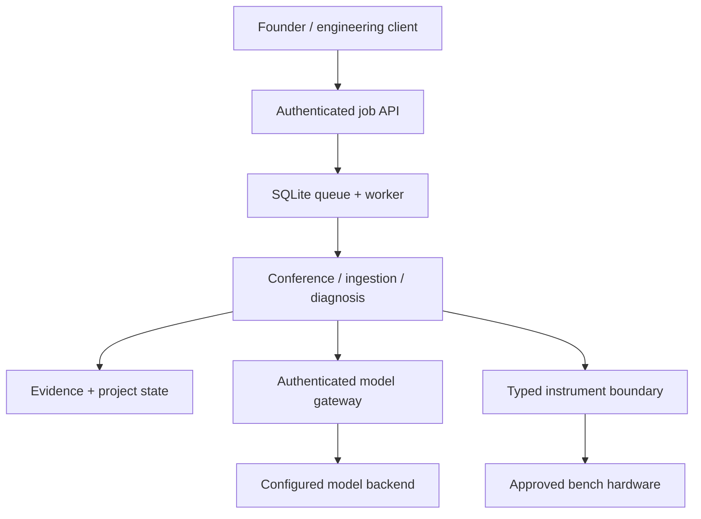

# Engineering Runtime Services

## Purpose and maturity

This document describes the deployable single-node alpha around the conference runtime. It connects six software control surfaces: agent deliberation, model routing, engineering evidence, project ingestion, closed-loop diagnosis and typed lab tools.

The implementation is suitable for local development, integration tests and shadow-mode bench evaluation. It is **not** authorization to energize an unknown board, release a design, or diagnose safety-critical hardware without the stated human and physical verification gates.

## Runtime topology



The model gateway and bench hardware are separate trust boundaries. Models propose structured analysis; deterministic code validates schemas, routes, revisions, evidence IDs and tool permissions. The instrument driver generates SCPI. Model-authored raw SCPI is prohibited.

## Implemented services

| Area | Implemented behavior | Deliberate limit |
|---|---|---|
| Agent conference | Screens all 184 roles, activates a bounded work cell, collects independent positions, records objections, revises, re-screens and fails closed | No claim that consensus is correct without evidence |
| Model routing | Selects standard/deep/maximum profiles from operation, risk, domains and work-cell size | Profile names require benchmarked model assignments |
| Model gateway | Bearer authentication, trusted-document hash verification, prompt separation, JSON-only request, schema validation, one repair retry and provenance | One compatible backend; no provider failover or budget ledger yet |
| Evidence | SHA-256 blobs, configuration-addressed records, lineage, integrity checks and claim assessments | A valid hash proves identity, not semantic support |
| Project ingestion | KiCad schematic/PCB subset, BOM CSV, firmware symbols and optional Git revision verification | Not a complete electrical/netlist or ECAD implementation |
| Diagnosis | Bayesian outcome update and expected information gain divided by cost/risk proxy | Seeded simulator; not yet wired to a live board session |
| Instruments | Typed PSU/DMM/scope actions, safety envelope, exact enable approval and result evidence | Generic SCPI must be qualified per vendor/model |
| Execution | SQLite WAL queue, atomic job claim, restart recovery, idempotency protection and one local worker | Single-node and single worker; no distributed lease/heartbeat |
| HTTP API | Health, submit job, poll job, token auth, body limit and path containment | No TLS termination, users, RBAC, rate limiting or streaming |
| Local web workspace | Plain-language idea intake, advanced constraints, run history, progress, specialist/objection inspection and report download | No project-file upload or live instrument view yet |

## Local CLI verification

Use Python 3.11 or newer:

```bash
python -m pip install -e .
python scripts/compile_agent_configs.py
hardware-copilot validate
python -m unittest discover -v
```

Ingest the included bounded project fixture:

```bash
hardware-copilot project-ingest \
  --manifest examples/demo_project/project.yaml \
  --project-root examples/demo_project \
  --data-root data
```

Exercise the information-gain diagnosis loop:

```bash
hardware-copilot debug-demo --data-root data --true-hypothesis H_FW
```

This simulation must finish with `root_cause_candidate` and evidence for every observation. It demonstrates state transitions and math, not real-world diagnostic accuracy.

## Evidence lifecycle

An evidence ID addresses both bytes and the context in which they are meaningful:

```text
evidence://sha256/<record digest>
    -> blob SHA-256
    -> source URI and media type
    -> project / hardware / firmware configuration
    -> instrument/action/calibration metadata when applicable
    -> parent evidence references
```

The same bytes captured against two board revisions intentionally receive different evidence IDs. A derived record is refused when a parent is missing or corrupt. Claim assessments use `supported`, `contradicted` or `inconclusive`; only the first two require valid evidence references. Semantic adjudication is explicit because cryptographic integrity cannot establish that a scope trace proves a causal claim.

## Project manifest

`schemas/runtime/project-manifest.schema.json` defines the accepted shape. The alpha supports:

- `kicad_schematic` — components and named labels;
- `kicad_pcb` — footprints, coordinates, pads and pad-to-net edges;
- `bom_csv` — common reference/designator headings;
- `firmware_tree` — bounded source files, macros, functions and register/GPIO tokens;
- `document` — evidence registration without semantic parsing.

Every source path must remain under the configured project root. If `firmware_revision` is supplied, the source tree must expose the same verifiable Git commit. Native design files remain authoritative; the graph is a derivative index.

## Safe instrument contract

The `BenchController` order is fixed:

1. resolve an allow-listed instrument identity;
2. verify the driver declares the typed capability;
3. validate hardware revision and deterministic limits;
4. require a still-valid approval bound to the exact action digest for output enable;
5. let the driver translate semantic parameters to bounded SCPI;
6. store action, descriptor, settings and result as evidence.

Implemented generic adapters cover common PSU voltage/current/output/measurement commands, read-only DC DMM measurement and bounded ASCII scope acquisition/configuration. A production driver is not “supported” until its exact model/firmware passes command, units, range, timeout, malformed-reply, channel-selection, error-queue and disconnect tests on isolated hardware. Out-of-band fusing/current limiting and emergency power removal must not depend on this software.

## Start the authenticated job API

### Simplest local workflow

```bash
python -m pip install -e .
hardware-copilot web
```

This command binds only to `127.0.0.1`, generates an ephemeral token when `COPILOT_API_TOKEN` is absent, prints the local URL and opens the default browser. The token is carried in the URL fragment, moved into browser session storage and removed from the address bar. It is not persisted across browser sessions.

The web workspace accepts a plain-language idea plus optional title, requirements, constraints, risk tier and deliberation limit. A deterministic intake layer converts it into a strict `TaskManifest`; that extraction only improves routing and does not assert that the idea is valid. All 184 agents are screened, the relevant work cell is shown, and the audit output remains downloadable as Markdown.

Use `hardware-copilot web --no-open` when browser launch is undesirable. To use a live gateway:

```bash
export COPILOT_MODEL_GATEWAY_URL='http://127.0.0.1:8090/v1/conference'
export COPILOT_MODEL_GATEWAY_API_KEY='replace-with-gateway-token'
hardware-copilot web --provider http
```

The gateway must already be running as described below. The interface visibly distinguishes live reasoning from dry-run orchestration.

### API-only workflow

```bash
export COPILOT_API_TOKEN='replace-with-a-long-random-token'
hardware-copilot serve \
  --repo-root . \
  --data-root data \
  --projects-root projects \
  --host 127.0.0.1 \
  --port 8080
```

Submit a job:

```bash
curl --fail --silent --show-error \
  -H "Authorization: Bearer $COPILOT_API_TOKEN" \
  -H "Content-Type: application/json" \
  -H "Idempotency-Key: demo-debug-001" \
  --data '{"operation":"debug_demo","payload":{"true_hypothesis":"H_FW"}}' \
  http://127.0.0.1:8080/v1/jobs
```

Poll `GET /v1/jobs/<job_id>` with the same authorization header. Reusing an idempotency key with different content is rejected. Jobs left `running` by a process interruption return to `queued` on restart.

Supported job operations are:

| Operation | Payload |
|---|---|
| `evidence_text` | `text`, optional `kind`, `source_uri`, `configuration`, `metadata` |
| `project_ingest` | inline `manifest` and `project_root` relative to the configured projects directory |
| `debug_demo` | optional `session_id`, `true_hypothesis`, threshold and step limit |
| `conference` | task manifest, optionally wrapped as `task` with `iterate_rounds` |
| `idea_conference` | plain `idea`, optional title/requirements/constraints, `T1` or `T2`, and iteration limit |

T3/T4 service conferences require non-empty evidence references that verify in this deployment's evidence store.

## Reference model gateway

The conference service calls the gateway contract at `/v1/conference`. Operate it as a separate process and use different inbound and provider credentials:

```bash
export COPILOT_MODEL_GATEWAY_API_KEY='replace-with-gateway-token'
export COPILOT_MODEL_BACKEND_URL='https://provider.example/v1/chat/completions'
export COPILOT_MODEL_BACKEND_API_KEY='replace-with-provider-secret'
export COPILOT_MODEL_STANDARD='standard-model-id'
export COPILOT_MODEL_DEEP='deep-model-id'
export COPILOT_MODEL_MAXIMUM='maximum-model-id'
hardware-copilot gateway --host 127.0.0.1 --port 8090
```

Then run the control plane with `--provider http` and `COPILOT_MODEL_GATEWAY_URL=http://127.0.0.1:8090/v1/conference`. Model identifiers are intentionally operator-supplied because selection must follow current benchmarks, privacy constraints, cost and latency—not a static brand preference.

## Container deployment

Copy `.env.example` to `.env`, replace all secrets, keep `COPILOT_PROVIDER=dry-run` until the gateway is ready, then run:

```bash
docker compose up --build
```

The Compose service binds to localhost, runs as a non-root user, drops Linux capabilities, sets a read-only root filesystem, mounts project inputs read-only and persists runtime data in a named volume. This is a local/on-prem baseline. Before network exposure, add TLS termination, secret management, per-user identity/RBAC, rate limiting, backup/restore testing, encrypted storage and centralized audit/metrics.

## Physical deployment gate

A software test passing is not a physical validation. A bench pilot should progress in this order:

1. disconnected driver conformance with captured protocol fixtures;
2. read-only identification/acquisition on a simulator or sacrificial instrument;
3. isolated low-energy load with hard current/voltage limits and manual emergency stop;
4. shadow-mode recommendations compared with a senior engineer;
5. approved guided measurements on a seeded-fault reference PCB;
6. only then, bounded autonomous state changes.

Record unsafe proposals, wrong-net guidance, false root causes, unnecessary experiments, interventions, repeatability and time-to-correct-root-cause. Agreement among agents is not an exit criterion; measured causal verification is.
